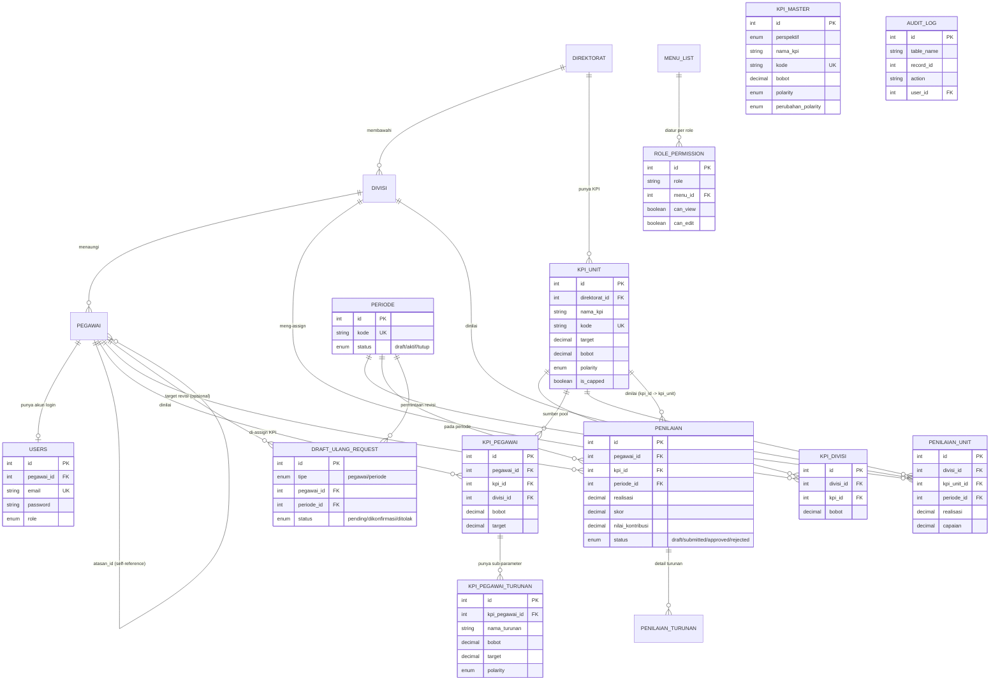

# Dokumentasi Requirement — Aplikasi KPI (Bank NTB Syariah)

> Disusun berdasarkan penelusuran langsung kode sumber, skema database, dan alur kerja yang benar-benar berjalan di aplikasi (bukan asumsi generik).

---

## 1. Business Rules

### 1.1 Struktur Organisasi & Peran

**Hierarki organisasi:** Direktorat → Divisi → Pegawai. Setiap pegawai terikat ke satu Divisi, dan setiap Divisi terikat ke satu Direktorat.

**5 role pengguna** dengan hak akses berbeda (dikontrol lewat tabel `role_permission`, per-menu, dengan dua level izin: `can_view` dan `can_edit`):

| Role | Cakupan Data | Ringkasan Akses (kondisi saat ini) |
|---|---|---|
| **admin** | Seluruh perusahaan | Akses penuh ke semua menu, satu-satunya role yang bisa kelola User & Role Permission |
| **hr** | Seluruh perusahaan | Setara admin untuk data KPI/penilaian/laporan, **kecuali** tidak bisa kelola Manajemen User dan tidak bisa akses Direktorat/KPI Unit/Data Unit Kerja |
| **drafter** | Divisi sendiri saja | Hanya bisa akses menu **Input Penilaian**, dibatasi pegawai di divisinya sendiri |
| **approver** | Divisi sendiri saja | Bisa akses **Input Penilaian** dan **Approval Penilaian**, dibatasi pegawai di divisinya sendiri |
| **pegawai** | — | Berdasarkan matriks permission saat ini, role ini **tidak memiliki akses view/edit ke menu manapun** — pegawai tidak melakukan self-service, seluruh input dilakukan oleh Drafter atas nama mereka |

**Aturan scoping data (berlaku wajib, ditegakkan di level query SQL, bukan cuma disembunyikan di tampilan):** Drafter & Approver hanya boleh melihat/mengubah data pegawai yang berada di **divisi yang sama** dengan dirinya. Admin & HR tidak dibatasi.

### 1.2 Struktur & Hierarki KPI

```
KPI Master (bank/template, per perspektif)
   → KPI Unit (di-assign ke Direktorat, dengan bobot & target per direktorat)
      → KPI Divisi (di-assign dari KPI Unit ke Divisi, dengan bobot khusus divisi)
         → KPI Pegawai (di-assign dari pool KPI Divisi ke pegawai individual)
            → Parameter Turunan (opsional — KPI Induk bisa dipecah jadi beberapa sub-parameter,
              masing-masing punya target & polarity sendiri)
```

- KPI dikelompokkan ke dalam **4 perspektif Balanced Scorecard**: `Financial`, `Customer`, `Internal Process`, `Learning & Growth`.
- **Polaritas KPI**: `max` (semakin besar realisasi semakin baik) atau `min` (semakin kecil semakin baik), dikombinasikan dengan `perubahan_polarity` (`pos`/`neg`) yang menentukan arah rasio perhitungan.
- **Realisasi = 0 adalah nilai valid untuk KPI berpolaritas `min`** (mis. 0 kasus fraud, 0 komplain) dan dihitung sebagai capaian terbaik — bukan dianggap "belum diisi". Field benar-benar dianggap belum diisi hanya jika dikosongkan (bukan diisi angka 0).
- **Total bobot wajib tepat 100%** pada setiap level assignment (KPI Divisi per divisi, KPI Pegawai per pegawai) sebelum dianggap valid.

### 1.3 Perhitungan Skor

Dua skema perhitungan berbeda tergantung level:

| Level | Fungsi | Skala | Catatan |
|---|---|---|---|
| KPI Pegawai (individu) | `hitungSkorCapaian()` | Skor band diskrit **1–4** (bukan kontinu) | Dipetakan dari % pencapaian lewat Kriteria Pencapaian (lihat di bawah) |
| KPI Unit/Divisi | `hitungCapaian()` | Rasio 0–1.5 (0%–150%) | Tidak berubah — dipakai untuk agregat performa unit, terpisah dari skema KPI Pegawai |

**Kriteria Pencapaian → Skor** (KPI Pegawai), berlaku sama untuk polaritas *max* (formula: Realisasi/Target×100%) maupun *min* (formula: Target/Realisasi×100%):

| Pencapaian | Skor |
|---|---|
| > 110% dari target | 4 |
| 100% s.d. 110% dari target | 3 |
| 80% s.d. <100% dari target | 2 |
| < 80% dari target | 1 |

Kasus khusus: realisasi = 0 pada KPI *min* (mis. 0 kasus fraud) langsung dipetakan ke **Skor 4** (capaian terbaik, menghindari pembagian dengan nol); target belum diisi (target = 0) dipetakan ke **Skor 1** (belum bisa dinilai).

**Nilai** per KPI = Skor (identik, tanpa transformasi tambahan). **Kontribusi** = Nilai × Bobot. Karena Bobot per pegawai selalu berjumlah 100%, **Nilai Akhir** (jumlah seluruh Kontribusi) berkisar **1.00–4.00**.

**KPI dengan Parameter Turunan** menggunakan validasi *all-or-nothing*: seluruh Turunan harus terisi sebelum KPI Induk-nya bisa disimpan (skor parsial tidak diperbolehkan, karena akan menyesatkan). Skor Induk = rata-rata tertimbang dari kontribusi seluruh Turunan (dibatasi ke rentang 1–4 yang sama).

**Grade akhir (Yudisium)** ditentukan dari Nilai Akhir/Kriteria Bobot Tertimbang α (skala 1.00–4.00). Batas bawah tiap pita **eksklusif**, batas atas **inklusif** — tepat di ambang batas masuk pita di bawahnya, bukan pita di atasnya:

| Grade | Label | Rentang α |
|---|---|---|
| IS | Istimewa | 3,5 < α ≤ 4,0 |
| SB | Sangat Baik | 2,5 < α ≤ 3,5 |
| B | Baik | 1,5 < α ≤ 2,5 |
| C | Cukup | α ≤ 1,5 |

### 1.4 Alur Status Penilaian

```
draft → submitted → approved
                  ↘ rejected → (Drafter revisi ulang) → submitted → ...
```

- Hanya bisa input/submit penilaian saat ada **satu periode berstatus `aktif`** (sistem menolak input jika tidak ada periode aktif).
- Hanya role `admin`, `hr`, atau `approver` yang berwenang meng-approve/menolak.
- Penolakan (`reject`) **wajib** disertai catatan alasan.

### 1.5 Periode Penilaian

- Status: `draft` → `aktif` → `tutup` (linear, tidak bisa mundur lewat alur normal).
- **Hanya boleh ada satu periode berstatus `aktif`** di waktu bersamaan — sistem menolak mengaktifkan periode baru jika masih ada yang aktif.
- Periode berstatus `tutup` mengunci seluruh data penilaian di periode tersebut — tidak ada alur normal yang bisa mengubahnya kembali.

### 1.6 Draft Ulang (Pengecualian Terkontrol atas Data Approved)

Mekanisme resmi satu-satunya untuk mengubah kembali penilaian yang **sudah approved** (baik per pegawai maupun massal per periode):

1. **Approver** mengajukan permintaan draft ulang + alasan wajib.
2. Tidak boleh ada permintaan lain yang masih `pending` untuk pegawai/periode yang sama.
3. **Admin** yang mengonfirmasi atau menolak permintaan tersebut.
4. Saat dikonfirmasi, seluruh penilaian `approved` terkait dikembalikan ke status `draft` (approval sebelumnya dianggap batal).
5. **Permintaan tidak bisa dikonfirmasi jika periode terkait sudah berstatus `tutup`** — mencegah data di periode yang sudah dikunci dibuka kembali secara tidak sengaja.

### 1.7 Keamanan & Audit

- Password di-hash dengan `password_hash()` (bcrypt), tidak pernah disimpan plaintext.
- Rate-limit login: maksimal 5 percobaan gagal per 15 menit per kombinasi IP+email.
- CSRF protection aktif secara global untuk seluruh form POST.
- Setiap perubahan data penting (KPI, penilaian, user, dsb.) dicatat di `audit_log` (siapa, kapan, nilai lama/baru, IP address).
- Notifikasi email otomatis (reminder pengisian KPI) dicatat historinya di `email_log`.

---

## 2. Use Case / User Journey

### 2.1 Aktor

| Aktor | Deskripsi |
|---|---|
| **Admin** | Pemilik penuh sistem — setup awal, kelola user & hak akses, wasit atas permintaan draft ulang |
| **HR** | Mengelola data organisasi & KPI, memantau seluruh laporan, setara Admin di luar manajemen akun |
| **Drafter** | Petugas input realisasi KPI untuk pegawai di divisinya |
| **Approver** | Atasan/pihak yang mereview & menyetujui penilaian sebelum final, bisa minta draft ulang |
| **Pegawai** | Subjek yang dinilai (saat ini tidak mengakses sistem secara langsung) |

### 2.2 Diagram Use Case (ringkas)

```mermaid
graph TB
  Admin((Admin))
  HR((HR))
  Drafter((Drafter))
  Approver((Approver))

  Admin --> UC1[Kelola Master Data<br/>Direktorat/Divisi/Pegawai/User]
  Admin --> UC2[Kelola KPI Master/Unit/Divisi/Pegawai]
  Admin --> UC3[Kelola Periode Penilaian]
  Admin --> UC4[Konfirmasi/Tolak Draft Ulang]
  Admin --> UC5[Kelola Role Permission]

  HR --> UC2
  HR --> UC3
  HR --> UC6[Input & Approve Penilaian]
  HR --> UC7[Lihat Rekap & Export Laporan]
  HR --> UC8[Kirim Notifikasi Email]

  Drafter --> UC9[Input Realisasi KPI Pegawai]
  Drafter --> UC10[Submit Penilaian untuk Approval]

  Approver --> UC11[Review & Approve/Tolak Penilaian]
  Approver --> UC12[Ajukan Permintaan Draft Ulang]
```



### 2.3 User Journey per Peran

**A. Admin — Setup KPI Baru untuk Periode Baru**
1. Buat Direktorat & Divisi (jika belum ada) → tambah data Pegawai.
2. Tambah KPI ke *KPI Master* per perspektif (Financial/Customer/Internal Process/Learning & Growth).
3. Assign KPI Master ke *KPI Unit* per Direktorat (tentukan target & bobot).
4. Assign KPI Unit ke *KPI Divisi* (bobot per divisi, total harus 100%).
5. Assign KPI Divisi ke *KPI Pegawai* per individu (bobot per pegawai, total harus 100%), opsional pecah jadi Parameter Turunan.
6. Buat Periode baru dan aktifkan (hanya bisa jika tidak ada periode aktif lain).

**B. Drafter — Input Realisasi KPI Bulanan/Periodik**
1. Login → buka menu *Input Penilaian*.
2. Pilih pegawai (dibatasi hanya pegawai di divisinya sendiri).
3. Isi realisasi tiap KPI yang ter-assign → sistem hitung skor secara real-time (AJAX).
4. Jika KPI punya Parameter Turunan, isi seluruh Turunan (all-or-nothing) — skor Induk dihitung otomatis dari rata-rata tertimbang.
5. Simpan sebagai draft → submit untuk direview Approver.

**C. Approver — Review & Approval**
1. Login → buka menu *Approval Penilaian*.
2. Lihat daftar penilaian berstatus `submitted` di divisinya.
3. Approve (mengunci angka final) atau Reject dengan catatan alasan (kembali ke Drafter untuk revisi).
4. Jika data yang **sudah approved** ternyata perlu direvisi lagi → ajukan **permintaan Draft Ulang** dengan alasan, menunggu konfirmasi Admin.

**D. Admin — Menindaklanjuti Permintaan Draft Ulang**
1. Buka menu *Permintaan Draft Ulang* → lihat daftar `pending`.
2. Konfirmasi (penilaian terkait kembali ke status `draft`, Drafter bisa input ulang) atau Tolak (dengan catatan).
3. Tidak bisa dikonfirmasi jika periode terkait sudah `tutup`.

**E. HR — Pemantauan & Pelaporan**
1. Login → buka menu *Rekap & Ranking* untuk melihat peringkat/distribusi grade seluruh pegawai.
2. Export *Laporan PDF/Excel* per periode.
3. Kirim reminder email ke Drafter/Approver yang belum menyelesaikan input (menu *Notifikasi Email*).
4. Gunakan *AI Asisten KPI* untuk analisis/rekomendasi berbasis data KPI periode berjalan.

---

## 3. Acceptance Criteria

Ditulis dalam format *Given–When–Then* untuk fitur-fitur inti.

### 3.1 Assignment Bobot KPI (Divisi & Pegawai)
- **Given** total bobot KPI yang ter-assign ke suatu Divisi/Pegawai belum 100%,
  **When** pengguna mencoba menyimpan/mengaktifkan,
  **Then** sistem menampilkan indikator "belum tepat 100%" dan tetap mengizinkan penyimpanan bobot parsial, namun total ditampilkan real-time saat bobot diubah.
- **Given** total bobot sudah tepat 100.00% (dibulatkan 2 desimal),
  **Then** indikator berubah menjadi status "sudah tepat 100%".

### 3.2 Input Realisasi KPI
- **Given** KPI berpolaritas `min` dan Drafter mengisi realisasi dengan angka **0**,
  **When** disimpan,
  **Then** KPI tersebut **tersimpan** (tidak di-skip) dan mendapat skor **maksimum** (capaian terbaik), bukan skor terendah.
- **Given** field realisasi **dikosongkan** (bukan diisi 0),
  **When** form disimpan,
  **Then** KPI tersebut **dilewati** (tidak tersimpan) — dianggap belum dinilai periode ini.
- **Given** KPI memiliki Parameter Turunan dan salah satu Turunan dikosongkan,
  **When** disimpan,
  **Then** seluruh KPI Induk beserta Turunannya **tidak tersimpan sama sekali** (all-or-nothing), untuk mencegah skor Induk yang menyesatkan dari data parsial.

### 3.3 Alur Approval
- **Given** penilaian berstatus `draft`,
  **Then** tidak bisa langsung di-approve/reject — harus melalui `submit` terlebih dahulu oleh Drafter.
- **Given** penilaian berstatus `submitted`,
  **When** Approver/HR/Admin melakukan reject tanpa mengisi catatan,
  **Then** sistem menolak aksi tersebut dan meminta catatan alasan wajib diisi.
- **Given** tidak ada periode berstatus `aktif`,
  **When** pengguna mencoba submit/approve/reject,
  **Then** sistem menolak dengan pesan "Tidak ada periode aktif."

### 3.4 Draft Ulang
- **Given** penilaian pegawai belum berstatus `approved`,
  **When** Approver mengajukan draft ulang untuk pegawai tersebut,
  **Then** sistem menolak — draft ulang hanya berlaku untuk data yang sudah `approved`.
- **Given** sudah ada permintaan draft ulang berstatus `pending` untuk pegawai/periode yang sama,
  **When** diajukan permintaan baru,
  **Then** sistem menolak dengan pesan sudah ada permintaan yang menunggu.
- **Given** periode terkait permintaan draft ulang sudah berstatus `tutup`,
  **When** Admin mencoba konfirmasi,
  **Then** sistem menolak dan penilaian **tidak** dikembalikan ke draft.

### 3.5 Batasan Akses Data (Scoping Divisi)
- **Given** user berperan `drafter`/`approver`,
  **When** mengakses data pegawai di luar divisinya (baik lewat halaman maupun manipulasi URL/ID langsung),
  **Then** sistem mengembalikan **403 Forbidden**, termasuk pada endpoint export Laporan PDF/Excel dan konteks AI Assistant (tidak boleh bocor lintas divisi).

### 3.6 Login & Keamanan
- **Given** 5 kali percobaan login gagal dari kombinasi IP+email yang sama dalam 15 menit,
  **When** percobaan ke-6 dilakukan,
  **Then** sistem menolak dengan pesan "Terlalu banyak percobaan login" tanpa memproses kredensial sama sekali.
- **Given** login berhasil,
  **Then** session ID diregenerasi (mencegah session fixation) dan `last_login` diperbarui.

### 3.7 Manajemen Periode
- **Given** sudah ada periode berstatus `aktif`,
  **When** Admin/HR mencoba mengaktifkan periode lain,
  **Then** sistem menolak dan meminta periode aktif ditutup terlebih dahulu.

---

## 4. Lampiran

### 4.1 ERD (Entity Relationship Diagram)

Berdasarkan skema database `db_kpi` yang berjalan saat ini (22 tabel; 4 tabel `rubrik_*` sudah tersedia migrasinya namun **belum ada Model/Controller yang memakainya** — fitur rubrik penilaian kualitatif tampaknya direncanakan tapi belum diimplementasikan).



**Tabel yang sudah tersedia skemanya tapi belum diimplementasikan fungsinya** (tidak ada Model/Controller yang mereferensikannya): `rubrik_esi`, `rubrik_kompetensi`, `rubrik_milestone`, `rubrik_pelatihan` — kemungkinan untuk pengembangan modul penilaian kualitatif di masa depan (indikasi lain: grup menu "Rubrik Saya" sudah terdaftar di `menu_list` namun belum berisi item menu apa pun).

### 4.2 Matriks Hak Akses Aktual (per role × menu)

| Menu | admin | hr | drafter | approver | pegawai |
|---|---|---|---|---|---|
| Direktorat & KPI Unit | ✅ | ❌ | ❌ | ❌ | ❌ |
| Data Unit Kerja | ✅ | ❌ | ❌ | ❌ | ❌ |
| KPI per Divisi | ✅ | ✅ | ❌ | ❌ | ❌ |
| KPI Per Pegawai | ✅ | ❌ | ❌ | ❌ | ❌ |
| Data Pegawai | ✅ | ✅ | ❌ | ❌ | ❌ |
| Periode | ✅ | ✅ | ❌ | ❌ | ❌ |
| Manajemen User | ✅ | ❌ | ❌ | ❌ | ❌ |
| Input Penilaian | ✅ | ✅ | ✅ (divisi sendiri) | ✅ (divisi sendiri) | ❌ |
| KPI Unit (Penilaian) | ✅ | ✅ | ❌ | ❌ | ❌ |
| Rekap & Ranking | ✅ | ✅ | ❌ | ❌ | ❌ |
| Approval Penilaian | ✅ | ✅ | ❌ | ✅ (divisi sendiri) | ❌ |
| Export PDF/Excel | ✅ | ✅ | ❌ | ❌ | ❌ |
| Notifikasi Email | ✅ | ✅ | ❌ | ❌ | ❌ |
| AI Asisten KPI | ✅ | ✅ | ❌ | ❌ | ❌ |

> Catatan: kolom di atas mencerminkan data `role_permission` saat ini di database, dapat diubah Admin lewat menu *Hak Akses Role* tanpa perlu perubahan kode.

### 4.3 Referensi Layar (Mockup berbasis UI yang sudah berjalan)

Karena aplikasi sudah diimplementasikan dan berjalan, bagian ini merujuk struktur layar yang **sudah ada**, bukan rancangan baru:

| Layar | File View | Elemen Kunci |
|---|---|---|
| Login | `app/Views/auth/login.php` | Form email+password, pesan error rate-limit |
| Dashboard | `app/Views/dashboard/*` | Kartu statistik (total pegawai, sudah/belum dinilai), distribusi grade, top performer, rata-rata per perspektif |
| KPI per Divisi | `app/Views/master/kpi_divisi/_form.php` | Panel kiri: KPI ter-assign + bobot; panel kanan: pool KPI Unit + pencarian nama/kode; indikator total bobot real-time |
| Input Penilaian | `app/Views/penilaian/_form.php` | Baris per KPI: input realisasi, skor live-preview (AJAX), badge Parameter Turunan |
| Approval Penilaian | `app/Views/penilaian/*` (aksi approve/reject) | Daftar submitted per divisi, tombol approve/reject + modal catatan |
| Permintaan Draft Ulang | `app/Views/draft_ulang/_content.php` | Daftar pending, tombol konfirmasi/tolak + catatan admin |
| Rekap & Ranking | `app/Views/rekap/_content.php` | Tabel ranking, filter divisi/direktorat/periode, badge grade berwarna |
| Notifikasi Email | `app/Views/notifikasi/_content.php` | Daftar user yang belum mengisi, tombol kirim reminder, histori pengiriman |
| Hak Akses Role | `app/Views/role_permission/_content.php` | Tab per role, checkbox can_view/can_edit per menu |

---

*Dokumen ini disusun berdasarkan kondisi kode & database per tanggal penyusunan — perlu ditinjau ulang setiap kali ada perubahan signifikan pada alur bisnis atau skema data.*
